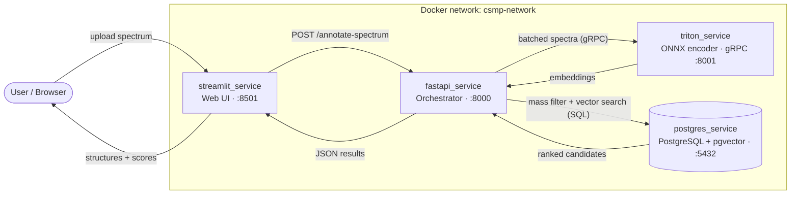
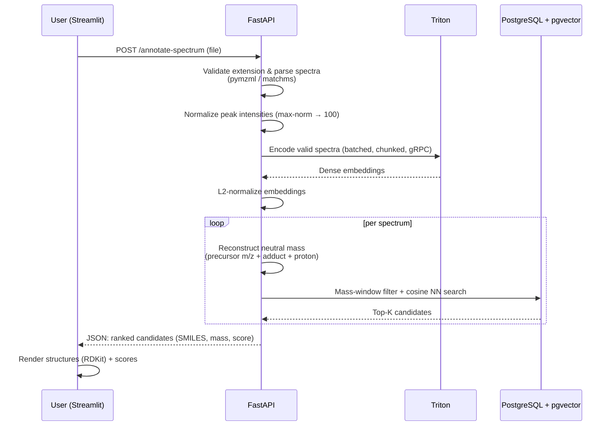

<div align="center">

# CSMP Search Engine

### Spectrum → Molecule annotation engine for tandem mass spectrometry

AI-powered retrieval system that turns an MS/MS spectrum into a ranked list of
candidate molecules, combining **exact mass filtering** with **deep-learning
embedding similarity search**.

<br/>


</div>

---

## Table of contents

- [Overview](#overview)
- [Key features](#key-features)
- [Architecture](#architecture)
- [How a query is processed](#how-a-query-is-processed)
- [The search algorithm](#the-search-algorithm)
- [Tech stack](#tech-stack)
- [Repository layout](#repository-layout)
- [Quick start](#quick-start)
- [Required external assets](#required-external-assets-model--data)
- [API reference](#api-reference)
- [Configuration](#configuration)
- [Database](#database)
- [Testing](#testing)
- [Limitations & future work](#limitations--future-work)

---

## Overview

In untargeted metabolomics and small-molecule research, an instrument produces
**MS/MS (tandem mass spectrometry) spectra**, but the chemical identity behind
each spectrum is unknown. **CSMP Search Engine** automates that annotation step.

A user uploads a spectrum file through a web interface. The system parses every
spectrum, encodes it into a dense vector with a neural **spectrum encoder**, and
searches a molecular database that stores precomputed **molecule embeddings**.
Candidates are first constrained to a physically plausible **mass window**
derived from the precursor m/z and adduct, then ranked by **embedding cosine
similarity**. The result is a short, ranked list of likely molecules — each with
its SMILES structure, monoisotopic mass, and a similarity score.

The whole system is **containerized** and ships as four independent
microservices orchestrated with Docker Compose.

---

## Key features

- 🔬 **Multi-format spectrum ingestion** — `.mzML`, `.MGF`, `.MSP`, `.JSON`.
- 🧠 **Neural spectrum encoding** served by NVIDIA Triton over gRPC (ONNX runtime).
- ⚡ **Hybrid retrieval** — exact mass-window pre-filtering + `pgvector` cosine
  nearest-neighbor search (HNSW index).
- 🎯 **Adduct-aware neutral-mass reconstruction** with a curated adduct lookup
  table and an escalating ppm-tolerance strategy.
- 🖼️ **Interactive UI** — spectrum previews (Plotly) and rendered 2D molecular
  structures (RDKit) for every candidate.
- 🩺 **Production-minded** — health checks, connection pooling, batched/chunked
  inference, multi-worker FastAPI, graceful per-spectrum error handling.

---

## Architecture

Four services communicate over a private Docker network. Only the UI and the API
are exposed to the host for everyday use.



| Service             | Role                                                            | Ports                         |
|---------------------|----------------------------------------------------------------|-------------------------------|
| `streamlit_service` | Web UI: upload, spectrum preview, results & structure rendering | `8501`                        |
| `fastapi_service`   | Orchestrator: parsing, inference calls, DB search              | `8000`                        |
| `triton_service`    | NVIDIA Triton serving the ONNX spectrum encoder                | `8001` gRPC / `8002` HTTP / `8003` metrics |
| `postgres_service`  | PostgreSQL + `pgvector` molecular database                     | `5432`                        |

---

## How a query is processed



Spectra **without a precursor m/z** are still parsed and returned, but candidate
search is skipped for them (the neutral mass cannot be reconstructed) — the
response carries an explanatory message instead.

---

## The search algorithm

The hybrid retrieval performed by the FastAPI `db_search_client` is the core of
the engine:

1. **Neutral-mass reconstruction.** From the precursor m/z, the candidate
   neutral masses are derived using the adduct lookup table (`mass_shift`,
   `n_mer`, `charge`) and proton-mass corrections. Several hypotheses are kept
   (adduct-based, `±` proton, and the raw precursor) and deduplicated.
2. **Escalating mass windows.** The base ppm tolerance is tried first, then
   widened (`×5`, `×20`) only if nothing is found — tight matches are preferred,
   but recall degrades gracefully.
3. **Mass pre-filter.** A B-tree index on `monoisotopic_mass` restricts the
   search to rows inside `mass ± Δ`.
4. **Vector ranking.** Within the filtered set, candidates are ordered by cosine
   distance against the query embedding using the `pgvector` HNSW index
   (`vector_cosine_ops`), returning the top-K.
5. **Optional vector-only fallback.** If no mass match is found, the engine can
   fall back to a pure vector search over the whole table (configurable).
6. **Scoring.** `similarity_score = clamp(1 − cosine_distance, 0, 1) × 100`,
   rounded — a higher score means a closer match.

---

## Tech stack

| Layer            | Technology                                              |
|------------------|--------------------------------------------------------|
| Language         | Python 3.11+                                            |
| API / orchestration | FastAPI, Uvicorn (multi-worker)                     |
| Web UI           | Streamlit, Plotly                                       |
| Model serving    | NVIDIA Triton Inference Server, ONNX Runtime (gRPC)    |
| Database         | PostgreSQL 16 + `pgvector` (HNSW)                       |
| Spectrum parsing | `pymzml`, `matchms`                                     |
| Cheminformatics  | RDKit (structure rendering)                             |
| Packaging        | Docker, Docker Compose, `uv` / `pip`                    |

---

## Repository layout

```
csmp_search_engine/
├── docker-compose.yml              # Orchestrates all four services
├── pyproject.toml                  # Workspace metadata / dev dependencies
├── AGENTS.md                       # Brief for AI coding agents
├── services/
│   ├── streamlit_service/          # Web UI
│   │   └── app.py
│   ├── fastapi_service/            # Orchestrator API
│   │   ├── app/
│   │   │   ├── main.py                   # POST /annotate-spectrum, GET /health
│   │   │   ├── spectrum_parser.py        # mzML/MGF/MSP/JSON → ParsedSpectrum
│   │   │   ├── spectrum_encoder_client.py# Triton gRPC client
│   │   │   ├── db_search_client.py       # mass filter + pgvector search
│   │   │   ├── utils.py                  # adduct normalization, neutral mass
│   │   │   ├── models.py                 # Pydantic schemas
│   │   │   ├── file_formats.py / inference_config.py
│   │   │   └── adducts_lookup_table.csv
│   │   ├── tests/run_api_tests.py        # integration test runner
│   │   └── test_cases/                   # sample spectra (valid + corrupted)
│   ├── triton_service/             # Triton server image
│   └── postgres_service/           # pgvector image + init/reload SQL
│       ├── initdb/                       # 01_schema, 02_seed, 03_indexes
│       └── scripts/reload_from_csv.sql
└── models/  data/  notebooks/      # Local-only assets (git-ignored, see below)
```

> **Note.** `models/`, `data/`, `notebooks/`, and `scripts/` are intentionally
> **git-ignored** — they hold multi-gigabyte model weights, the database
> cluster, the seed CSV, and research notebooks. They must be provided locally
> (see the next section).

---

## Quick start

### Prerequisites

- Docker & Docker Compose v2
- The [external assets](#required-external-assets-model--data) placed on disk
- ~3 GB free space for the model, plus space for the database

### Run everything

```bash
docker compose up --build
```

Then open the UI:

| Service          | URL                                                |
|------------------|----------------------------------------------------|
| Streamlit UI     | http://localhost:8501                              |
| FastAPI docs     | http://localhost:8000/docs (interactive Swagger)  |
| Triton readiness | http://localhost:8002/v2/health/ready             |

Upload one of the sample files in
`services/fastapi_service/test_cases/` (e.g. `test_file.mzML`), preview the
spectra, and click **Search for candidate molecules**.

---

## Required external assets (model & data)

Because of their size, the model and the seed data are **not** in the repository.
Place them at these paths before starting:

**1. Triton model repository** → `models/`

```
models/
└── spectrum_encoder/
    ├── config.pbtxt
    └── 3/
        ├── csu-ms-2-spec-encoder.onnx
        └── csu-ms-2-spec-encoder.onnx.data
```

See [`models/README.md`](models/README.md) for the exact input/output contract.

**2. Seed CSV for the database** → `data/postgres_molecular_search_db/molecules_with_embeddings.csv`

Columns: `formula, smiles, inchikey, monoisotopic_mass, mol_embedding`, where
`mol_embedding` is a 256-dimensional vector (whitespace- or comma-separated,
optionally bracketed). It is mounted into the DB container at `/seed/…` and
loaded on first startup.

---

## API reference

### `GET /health`

Liveness probe → `{"status": "ok"}`.

### `POST /annotate-spectrum`

Multipart upload of a single spectrum file (`.mzML`, `.MGF`, `.MSP`, `.JSON`).
Returns `202 Accepted` with one result block per parsed spectrum.

```bash
curl -X POST http://localhost:8000/annotate-spectrum \
  -F "file=@services/fastapi_service/test_cases/test_file.mzML"
```

**Response (shape):**

```jsonc
{
  "status": "accepted",
  "file_name": "test_file.mzML",
  "file_type": "mzML",
  "message": "Successfully parsed N spectra. ...",
  "results": [
    {
      "spectrum_id": "1",
      "precursor_mz": 162.1157,
      "candidates": [
        { "smiles": "O=C1CCCN1CC#CCN1CCCC1", "mass": 162.1157, "similarity_score": 91.0 },
        { "smiles": "CC(C[N+](C)(C)C)OC(=O)N", "mass": 166.0629, "similarity_score": 74.0 }
      ],
      "message": "Spectrum parsed, encoded, and searched successfully."
    }
  ]
}
```

Error handling: unsupported extensions and unparsable/corrupted files return
`400` with a descriptive `detail`. Inference or DB failures degrade gracefully —
the spectrum is still returned with an explanatory `message` and no candidates.

---

## Configuration

All configuration is via environment variables (defaults shown). The most useful
ones are set in `docker-compose.yml`.

**FastAPI — inference (`inference_config.py`)**

| Variable                     | Default              | Description                       |
|------------------------------|----------------------|-----------------------------------|
| `TRITON_GRPC_URL`            | `triton_service:8001`| Triton gRPC endpoint              |
| `TRITON_MODEL_NAME`          | `spectrum_encoder`   | Served model name                 |
| `TRITON_MODEL_VERSION`       | *(latest)*           | Model version to query            |
| `SPECTRUM_MAX_PEAKS`         | `1024`               | Peaks per spectrum fed to encoder |
| `SPECTRUM_INFER_CHUNK_SIZE`  | `32`                 | gRPC inference chunk size         |
| `TRITON_INFER_TIMEOUT_SECONDS`| `30`                | Per-request inference timeout     |
| `UVICORN_WORKERS`            | `4`                  | FastAPI worker processes          |

**FastAPI — search & database (`db_search_client.py`)**

| Variable                          | Default             | Description                          |
|-----------------------------------|---------------------|--------------------------------------|
| `POSTGRES_HOST` / `POSTGRES_PORT` | `postgres_service` / `5432` | DB connection                |
| `POSTGRES_DB`                     | `molecular_search_db`| Database name                       |
| `POSTGRES_USER` / `POSTGRES_PASSWORD` | `csmp_user` / `csmp_password` | Credentials          |
| `POSTGRES_MOLECULAR_TABLE`        | `molecular_search`  | Table to search                      |
| `SEARCH_PPM_TOLERANCE`            | `100`               | Base mass tolerance (ppm)            |
| `SEARCH_TOP_K`                    | `10`                | Candidates returned per spectrum     |
| `SEARCH_MIN_MASS_WINDOW_DA`       | `0.01`              | Minimum absolute mass window (Da)    |
| `SEARCH_ALLOW_VECTOR_ONLY_FALLBACK`| `true`             | Vector-only search if no mass match  |
| `POSTGRES_POOL_MIN_SIZE` / `_MAX_SIZE` | `1` / `8`      | Connection pool sizing               |

**Streamlit**

| Variable          | Default                       | Description           |
|-------------------|-------------------------------|-----------------------|
| `FASTAPI_BASE_URL`| `http://fastapi_service:8000` | Backend API base URL  |

---

## Database

PostgreSQL with the `pgvector` extension. The schema, seed load, and indexes are
created automatically on **first** startup (when the data volume is empty) by the
scripts in `services/postgres_service/initdb/`:

```sql
CREATE TABLE molecular_search (
    formula            TEXT,
    smiles             TEXT NOT NULL,
    inchikey           TEXT PRIMARY KEY,
    monoisotopic_mass  DOUBLE PRECISION NOT NULL,
    mol_embedding      VECTOR(256) NOT NULL
);
-- B-tree on monoisotopic_mass + formula, HNSW (vector_cosine_ops) on mol_embedding
```

The cluster is persisted on a host mount, so restarts are fast and data survives.

**Reload data from CSV** (without recreating the cluster):

```bash
docker compose exec postgres_service \
  psql -U csmp_user -d molecular_search_db -f /opt/db-scripts/reload_from_csv.sql
```

**Full re-initialization from scratch:**

```bash
docker compose down
rm -rf data/postgres_molecular_search_db/postgres_data/*
docker compose up --build
```

---

## Testing

A self-contained integration runner exercises `/annotate-spectrum` against every
fixture in `test_cases/` (valid files of each format, files without a precursor,
and a deliberately corrupted file expecting `400`).

With the stack already running:

```bash
docker compose --profile test up --build api_tests
```

Or run it directly against a reachable API:

```bash
API_BASE_URL=http://localhost:8000 \
  python services/fastapi_service/tests/run_api_tests.py
```

---

## Limitations & future work

- **Precursor m/z is required.** Spectra without a precursor m/z cannot have
  their neutral mass reconstructed, so candidate search is skipped. A future
  fallback could infer candidates from peak patterns or metadata alone.
- **Fixed inference batch shape.** The encoder currently pads to a fixed peak
  count; the ONNX export must be regenerated when the batching scheme changes.
  A dynamic-shape encoder would improve inference efficiency.
- **Single encoder.** The architecture treats embedding models as swappable —
  additional encoders, ensemble ranking, or feedback-driven re-ranking are
  natural extensions.

---

<div align="center">
<sub>Built as a diploma project — a hybrid mass-filter + embedding retrieval engine for MS/MS molecular annotation.</sub>
</div>
